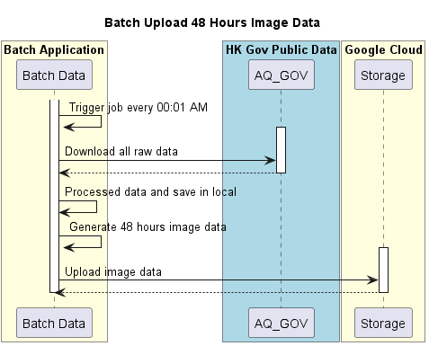

# HKU Air Quality Forecasting Data

## Overview
HKU Air Quality Forecasting Data is a batch application designed to periodically generate 48-hour forecasts and upload the results to Google Cloud Storage every day at 00:01. The process begins by downloading raw data from public sources, followed by pre-processing to convert it into the desired format. Once the data is prepared, the application generates visualizations based on the processed information and uploads the resulting image files to cloud storage.

## Technology Stack
- Python 3.12  
- FastAPI 0.115.12  
- Google Cloud Storage

## Installation and Usage

### Prerequisites
- Python 3.12

### Steps
```bash
cd hku-air-quality-forecasting-data
python3.12 -m venv .venv # Or create virtual environment
source ./.venv/bin/activate # Or activate virtual environment
pip install -r requirements.txt
uvicorn main:app --reload # Window
gunicorn -w 1 -k uvicorn.workers.UvicornWorker main:app --bind 0.0.0.0:8000 # Linux
```
### Sequence Diagram
